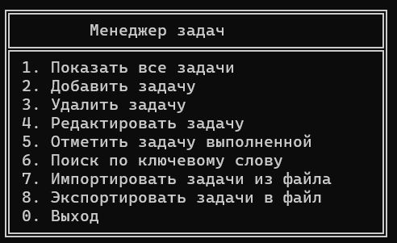
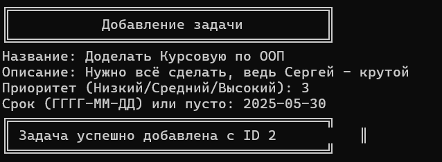

# task-manager
Консольное приложение для управления задачами, написанное на C++ с применением объектно-ориентированного программирования.

## Описание
**Task Manager** — это CLI-приложение, которое позволяет:
- Добавлять, редактировать и удалять задачи
- Фильтровать по статусу, приоритету или категории
- Сохранять задачи в JSON-формате
- Загружать и восстанавливать список задач

- ## Возможности

-  Добавление задач с дедлайном, приоритетом и категорией
-  Поиск и фильтрация
-  Сохранение и загрузка из файлов
-  Работа с JSON (nlohmann/json)

-  ## 🖼️ Скриншоты


<sub>Главное меню</sub>


<sub>Форма добавления задачи</sub>

## 🛠️ Сборка и запуск

### Зависимости
- C++17
- [CMake](https://cmake.org/) ≥ 3.17
- [nlohmann/json](https://github.com/nlohmann/json)

### Сборка

```bash
git clone https://github.com/Bircka22/task-manager.git
cd task-manager
mkdir build && cd build
cmake ..
make
./task_manager
